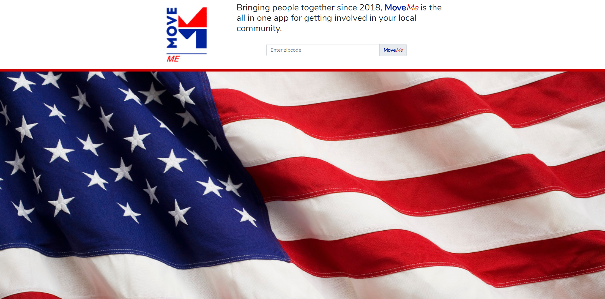
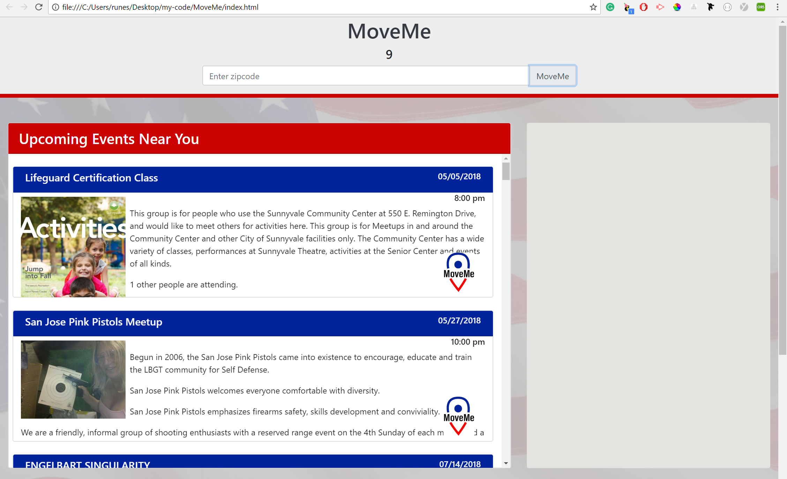
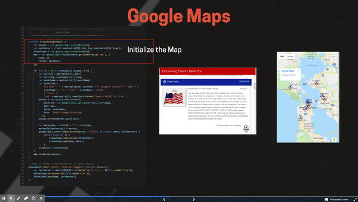
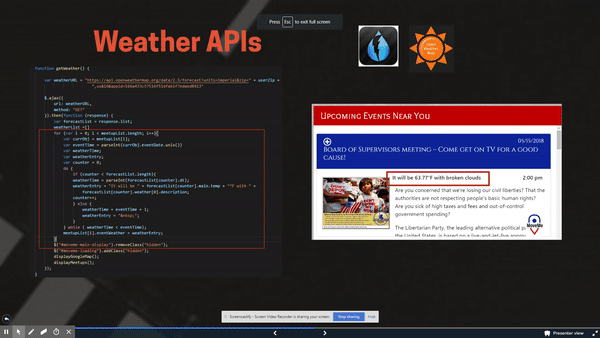
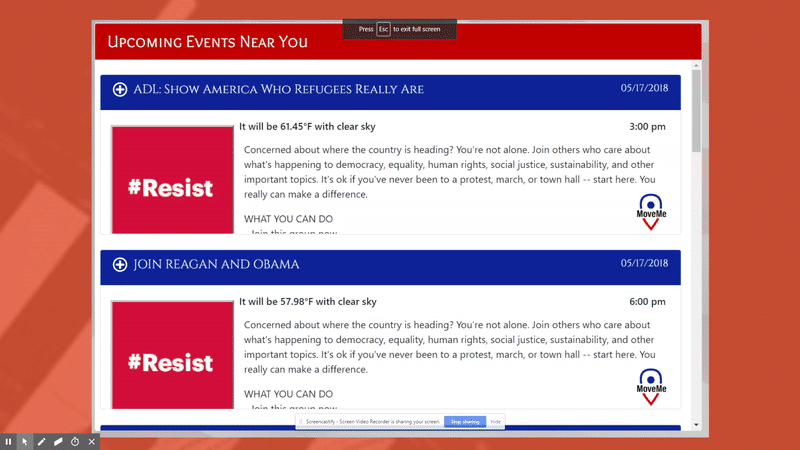
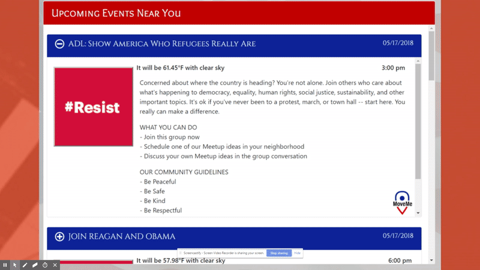
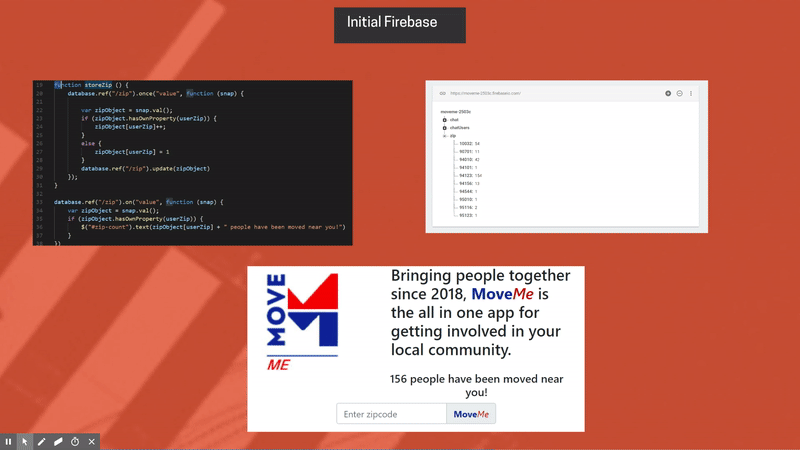
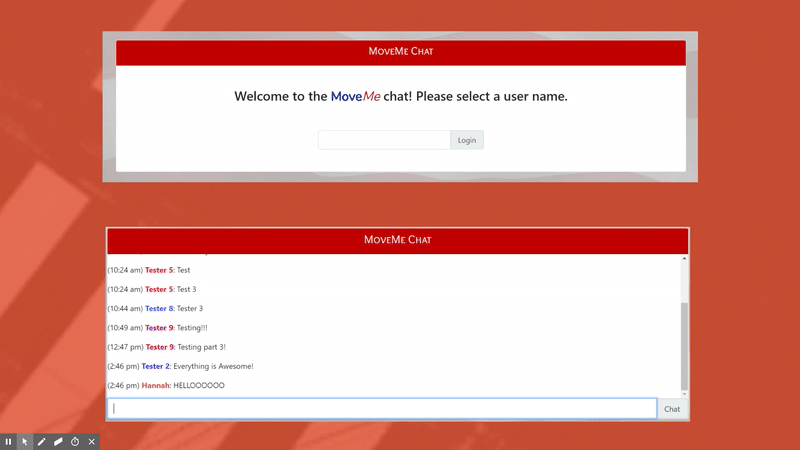
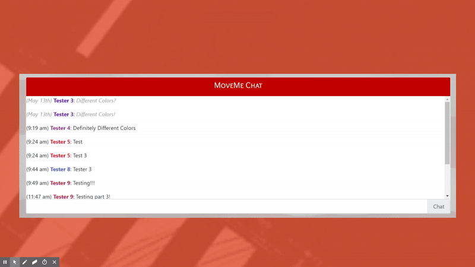

# MoveMe
Bringing people together since 2018, MoveMe is the all in one app for getting involved in your local community.

MoveMe was created to provide people easy access to find and join political or community events. Users are prompted to enter his/her zipcode and MoveMe will generate upcoming events from the Meetup.com and the location from Google Maps. We have also created a chat feature for MoveMe users to connect with other users online.

All these elements combine to create a user experience that is both functional and intuitive.

## Getting Started

Open up the [project link](https://sun1devil.github.io/MoveMe/) and you should be able to see the example webpage shown below:

Enter your zip code and join the MoveMe nation! See what people just like you are getting involved in in your local community. With every step forward, we stem the rising tide of apathy and take ownership of the future of our nation!

### Prerequisites

You need to have a modern browser able to handle HTML5, Javascript, and CSS (such as the Google Chrome browser).

### Installing

No installation needed! Just open the page in your preferred browser.

## Built With

* HTML5

* CSS

* [Javascript](https://www.javascript.com/) - The scripting language used

* [BootstrapCDN v4.1.0](https://getbootstrap.com/docs/4.1/getting-started/introduction/) - The web framework used

* [jQuery v3.3.1](http://jquery.com/) - Java library for DOM and CSS manipulation

* [Moment.js 2.22.1](https://momentjs.com/) - Java Library for Time calculations

* [Google Firebase 4.13.0](https://firebase.google.com/) - Online database

* [Google Fonts](https://fonts.google.com/) - Font repository

* [Google Maps API](https://developers.google.com/maps/documentation/) - Google Maps

* [Meetup API](https://www.meetup.com/meetup_api/) - Meetup

* [Weather API](https://openweathermap.org/api) - Open Weather Map

## APIs

### Meetup API

We used the Meetup.com API to pull events from the movements and politics category. Our queryURL shows that we filter based on the zipcode users entered, a radius of 10 miles, category and upcoming events. After executing that URL, we get a JSON file which we had to parse for relevant data. Within our ajax function we included a for loop that iterates through each event in the JSON file to retrieve the details for relevant events. With the details from the JSON file, we created an array called meetupList so that we can store each event and the related details as objects within the array for easy reference by other parts of the code.

### Google Maps API

We used the Google Maps API to add and display the map along with the pins for each MeetUp event. This was done by creating a for loop that iterates through the meetupList array to get the latitude, longitude, event name and event info. This returned a pin for the location of each event along with the event name and event information. The event name and information, such as date, time and RSVP URL were all displayed on each individual pin on our Google Maps. This allowed our users to be able to click a pin in the Map, which then displayed this information. If the user was interested in attending the event, they could click on the event URL that was displayed on the pin and it would take then to the linked RSVP page in MeetUp.

### Open Weather Map API

This was a learning experience for us. we began using the [Dark Sky weather API](https://darksky.net/dev) and after we got it running, we realized we couldn't get multiple day forecasts without making individual calls for each day needed. This required us to pivot and switch to the Open Weather Map API which gave us 16 days of weather data. Once we had the data, we wrote a clever loop to iterate through the forecast days and compare the unix converted date values with our meetUp event dates to find the weather on the date of our event. This process demonstrated just how much time, effort, strategy and brain strain can go into getting just one line of content.

## Dynamic Generation

Our events display  shows the user all the available events in their area. Each of these elements is dynamically generated including the MoveMe pin on the bottom right. We had to iterate through the array of event objects we created from the meetup and weather APIs and dynamically generate each component html element. In order for the pins to show the event they correspond to on the map, we had to store the latitude and longitude as data within the html element. Also we discovered that some of the event descriptions included links, so we’re forcing them to open in a new tab in order to not disrupt the user experience.

If the user was interested in an event, we wanted them to be able to dive into the details of that event. When the user clicks on the header or body of the event, the event details will accordion out for easier reading, and when they’re done, they can click on the header again in order to minimize the event for easier navigation. When the user clicks on the header, we’re toggling the accordion icon. However, in order to expand the body, we have to use jQuery’s built in “next” method, since the body is the next sibling of the header. Similarly we have to use the “previous” method to find the header if the user clicked on the body and then find the accordion icon class within that header.

## Google Firebase

### User Zip Codes

Our initial Firebase usage was pretty basic. We originally planned to use it for just storing user zip codes so that we could capture them and recall them later. We capture the zip codes on user input and store them into Firebase. Each time we get a user from the same zip code, we add to our count of views from that zip code. When a new zip code is entered, we check the database and if Firebase already has a value for it, we add to the count; if not, we initialise a new entry at one. We pull the count from firebase and display it above the input box to let users see how many others in their area have expressed an interest in community involvement.

### Chatroom

We wanted to give users a platform to socialize and plan meetups, so we designed and implemented a chat function. The user selects a user name and then jumps directly into our chatroom. We store their user name along with a unique color associated with their account in order to foster a sense of continuity if they return. We stored the chat messages in firebase along with identifying data like the user name, that user’s color, and the time they were sent so we could minimize the Firebase calls we required.

Each chat message includes a unique color for the user along with a time-stamp. Messages from the current day show what time they were sent while messages that are older than one day only show the date they were sent and are greyed out to give more prominence to recent messages. When the user logs in, if they have never used our chat service before, we generate a color for them using a random number generator to give us a rgb color value. Then, upon the first time the user loads the chat or when a new chat message is created, we check each message to see if the message is recent. If it is, we display the time, otherwise, we display the date and grey it out. In order to minimize clutter, we delete older messages by checking whether a message is older than 30 days and delete it if it is.

## Authors

* **Mindy De Alba**  - [Mdealba](https://github.com/Mdealba)

* **Hannah Lim** - [hannahlim213](https://github.com/hannahlim213)

* **John McLeod**  - [sun1devil](https://github.com/sun1devil)

* **Robert Shaw**  - [robertshaw87](https://github.com/robertshaw87)

## License

This project is licensed under the MIT License - see the [LICENSE.md](LICENSE.md) file for details

